# Circuit Breaker Flow Diagram

## Overview
This diagram shows the logical flow of the Circuit Breaker Service, including state management, failure tracking, queue control, and alert notifications.

```mermaid
flowchart TD
    %% Entry Points
    Start([API Request Received]) --> CheckState{Check Circuit State}
    FailureOccurred([API Failure Occurred]) --> RecordFailure[Record Failure in Redis]
    SuccessOccurred([API Success Occurred]) --> RecordSuccess[Record Success]
    
    %% State Checking Logic
    CheckState -->|CLOSED| AllowRequest[Allow Request ✅]
    CheckState -->|OPEN| CheckTimeout{Check Recovery Timeout}
    CheckState -->|HALF_OPEN| AllowRequestHalfOpen[Allow Request (Testing) ⚠️]
    
    %% OPEN State Timeout Check
    CheckTimeout -->|Timeout Not Reached| BlockRequest[Block Request ❌]
    CheckTimeout -->|Timeout Reached| TransitionToHalfOpen[Transition to HALF_OPEN]
    TransitionToHalfOpen --> AllowRequestHalfOpen
    
    %% Failure Recording Logic
    RecordFailure --> AddToSlidingWindow[Add to Sliding Window<br/>in Redis Sorted Set]
    AddToSlidingWindow --> CleanOldFailures[Remove Failures<br/>Outside Window]
    CleanOldFailures --> CountFailures{Count Failures<br/>in Window}
    
    CountFailures -->|< 5 failures| KeepClosed[Keep CLOSED State]
    CountFailures -->|≥ 5 failures| TriggerOpen[Trigger Circuit OPEN]
    
    %% Success Recording Logic
    RecordSuccess --> CheckCurrentState{Check Current State}
    CheckCurrentState -->|CLOSED| ResetFailures[Reset Failure Count]
    CheckCurrentState -->|HALF_OPEN| TrackSuccesses[Track Consecutive Successes]
    CheckCurrentState -->|OPEN| DoNothing[No Action Needed]
    
    %% Half-Open Success Tracking
    TrackSuccesses --> CheckSuccessCount{Success Count ≥ 3?}
    CheckSuccessCount -->|No| ContinueHalfOpen[Continue HALF_OPEN]
    CheckSuccessCount -->|Yes| TriggerClose[Trigger Circuit CLOSED]
    
    %% State Transitions with Side Effects
    TriggerOpen --> SetOpenState[Set State to OPEN]
    SetOpenState --> PauseQueues[Pause Service Queues]
    PauseQueues --> SendCriticalAlert[Send Critical Alert]
    SendCriticalAlert --> LogStateChange[Log State Change]
    
    TriggerClose --> SetClosedState[Set State to CLOSED]
    SetClosedState --> ResumeQueues[Resume Service Queues]
    ResumeQueues --> SendInfoAlert[Send Info Alert]
    SendInfoAlert --> LogRecovery[Log Recovery]
    
    %% Manual Operations
    ManualPause([Manual Pause Requested]) --> ForceOpen[Force State to OPEN]
    ForceOpen --> PauseQueues
    
    ManualResume([Manual Resume Requested]) --> ForceClose[Force State to CLOSED]
    ForceClose --> ResumeQueues
    
    %% Health Check & Status
    HealthCheck([Health Check]) --> CheckRedis{Redis Connected?}
    CheckRedis -->|Yes| HealthyStatus[Return Healthy Status]
    CheckRedis -->|No| UnhealthyStatus[Return Unhealthy Status]
    
    StatusRequest([Status Request]) --> GatherStatus[Gather All Service States]
    GatherStatus --> ReturnStatus[Return Complete Status]
    
    %% Styling
    classDef closed fill:#d4e6d4,stroke:#4a7c4a,stroke-width:2px
    classDef open fill:#f8d7da,stroke:#721c24,stroke-width:2px
    classDef halfopen fill:#fff3cd,stroke:#856404,stroke-width:2px
    classDef action fill:#e7f3ff,stroke:#0066cc,stroke-width:2px
    classDef alert fill:#f0e68c,stroke:#b8860b,stroke-width:2px
    
    class AllowRequest,KeepClosed,SetClosedState,ResumeQueues closed
    class BlockRequest,TriggerOpen,SetOpenState,PauseQueues open
    class AllowRequestHalfOpen,TransitionToHalfOpen,TrackSuccesses halfopen
    class RecordFailure,RecordSuccess,AddToSlidingWindow,CleanOldFailures action
    class SendCriticalAlert,SendInfoAlert,LogStateChange,LogRecovery alert
```

## State Descriptions

### 🟢 CLOSED State (Normal Operation)
- **Condition**: System is healthy, failures below threshold
- **Behavior**: All requests are allowed through
- **Monitoring**: Tracks failures in sliding window
- **Transition**: Moves to OPEN when failure threshold (5) is reached

### 🔴 OPEN State (Service Unavailable)
- **Condition**: Failure threshold exceeded
- **Behavior**: All requests are blocked
- **Side Effects**: 
  - Service queues are paused
  - Critical alerts are sent
- **Transition**: Moves to HALF_OPEN after recovery timeout (60 seconds)

### 🟡 HALF_OPEN State (Testing Recovery)
- **Condition**: Recovery timeout has passed while in OPEN state
- **Behavior**: Requests are allowed but monitored closely
- **Monitoring**: Tracks consecutive successes
- **Transition**: 
  - Moves to CLOSED after 3 consecutive successes
  - Moves back to OPEN if any failure occurs

## Key Parameters

| Parameter | Value | Description |
|-----------|--------|-------------|
| Failure Threshold | 5 | Number of failures before opening circuit |
| Failure Window | 300 seconds | Time window for failure tracking |
| Recovery Timeout | 60 seconds | Time before testing recovery |
| Success Threshold | 3 | Successes needed to close circuit |

## Queue Management

```mermaid
flowchart LR
    CircuitOpen[Circuit OPEN] --> PauseKey[Set pause_key in Redis]
    PauseKey --> QueuesPaused[Queues Paused ⏸️]
    
    CircuitClosed[Circuit CLOSED] --> DeleteKey[Delete pause_key from Redis]
    DeleteKey --> QueuesResumed[Queues Resumed ▶️]
    
    CheckStatus[Check Queue Status] --> KeyExists{pause_key exists?}
    KeyExists -->|Yes| Paused[Queues are Paused]
    KeyExists -->|No| Active[Queues are Active]
```



## Alert System Flow

```mermaid
flowchart TD
    StateChange[Circuit State Change] --> GetMetadata[Get Failure Metadata]
    GetMetadata --> DetermineLevel{Determine Alert Level}
    
    DetermineLevel -->|OPEN| CriticalAlert[Critical Alert 🚨]
    DetermineLevel -->|CLOSED| InfoAlert[Info Alert ℹ️]
    DetermineLevel -->|HALF_OPEN| WarningAlert[Warning Alert ⚠️]
    
    CriticalAlert --> LogAlert[Log to Application Logs]
    InfoAlert --> LogAlert
    WarningAlert --> LogAlert
    
    LogAlert --> NotifyServices[Notify External Services<br/>(if configured)]
```

This diagram shows the complete lifecycle of the circuit breaker, from request processing through failure tracking, state transitions, queue management, and alert notifications. 